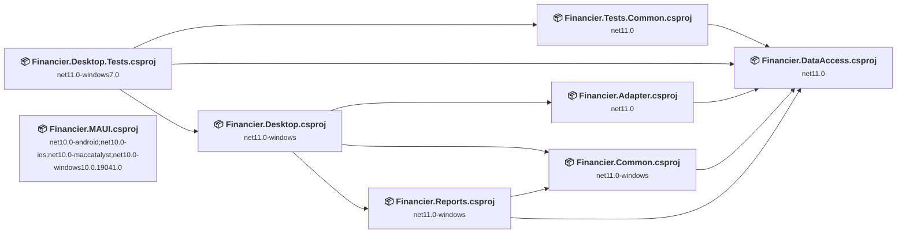
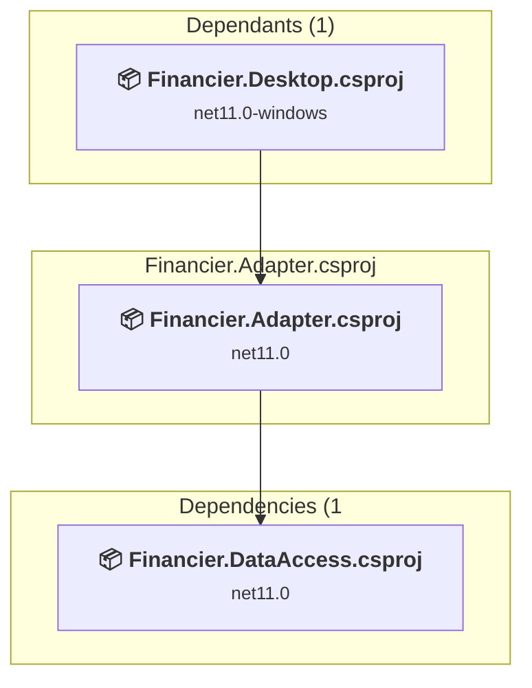
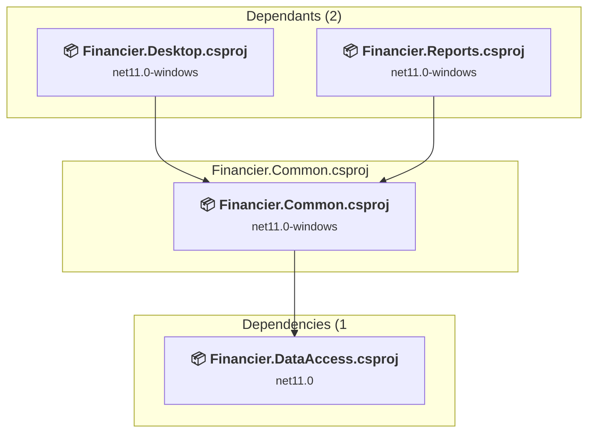
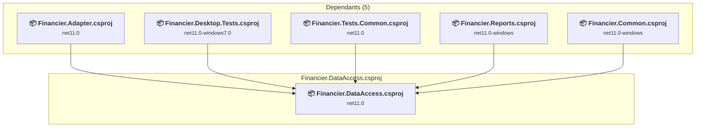
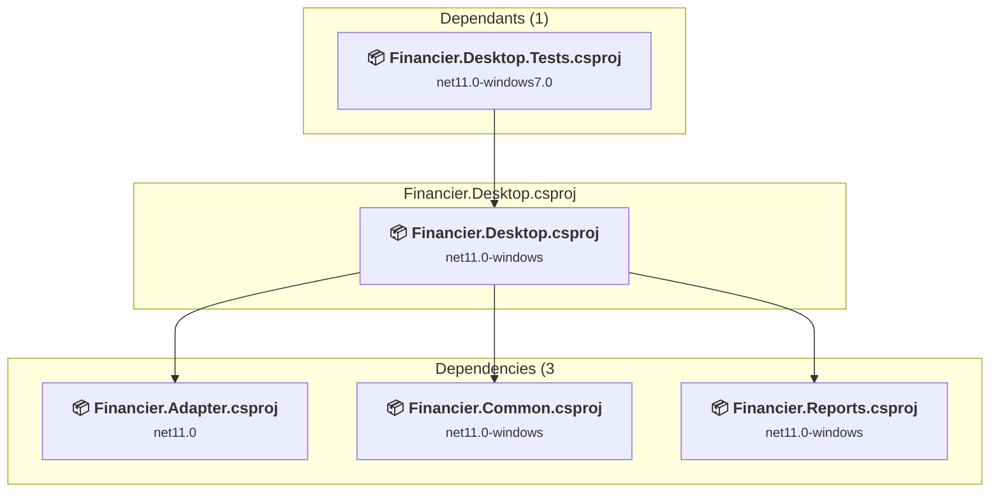
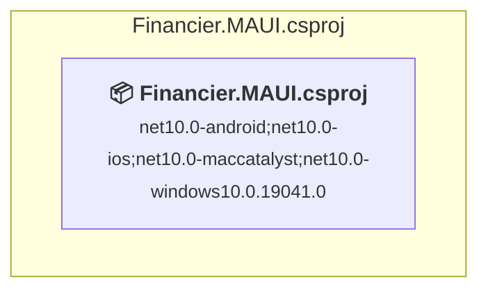
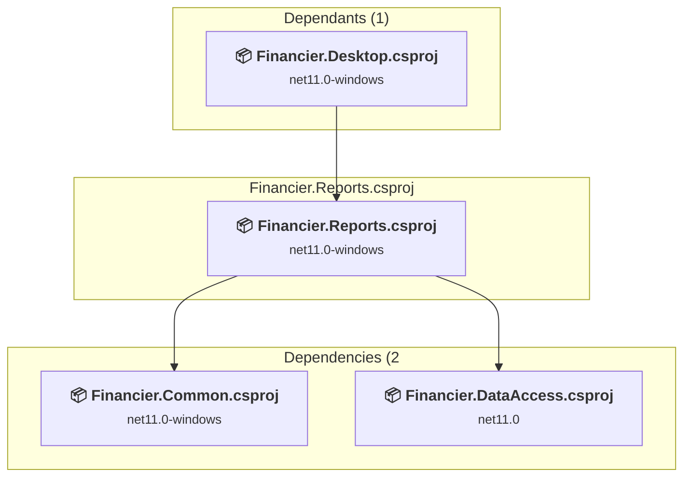
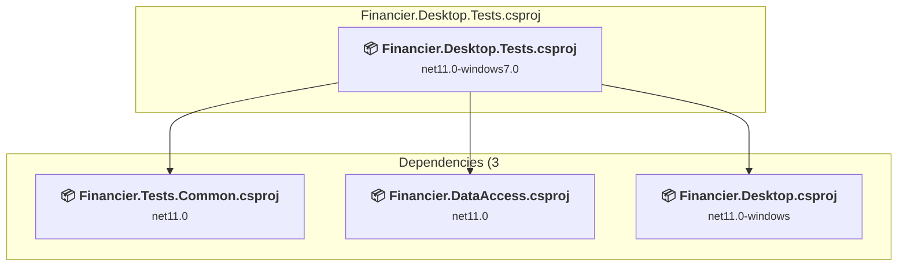
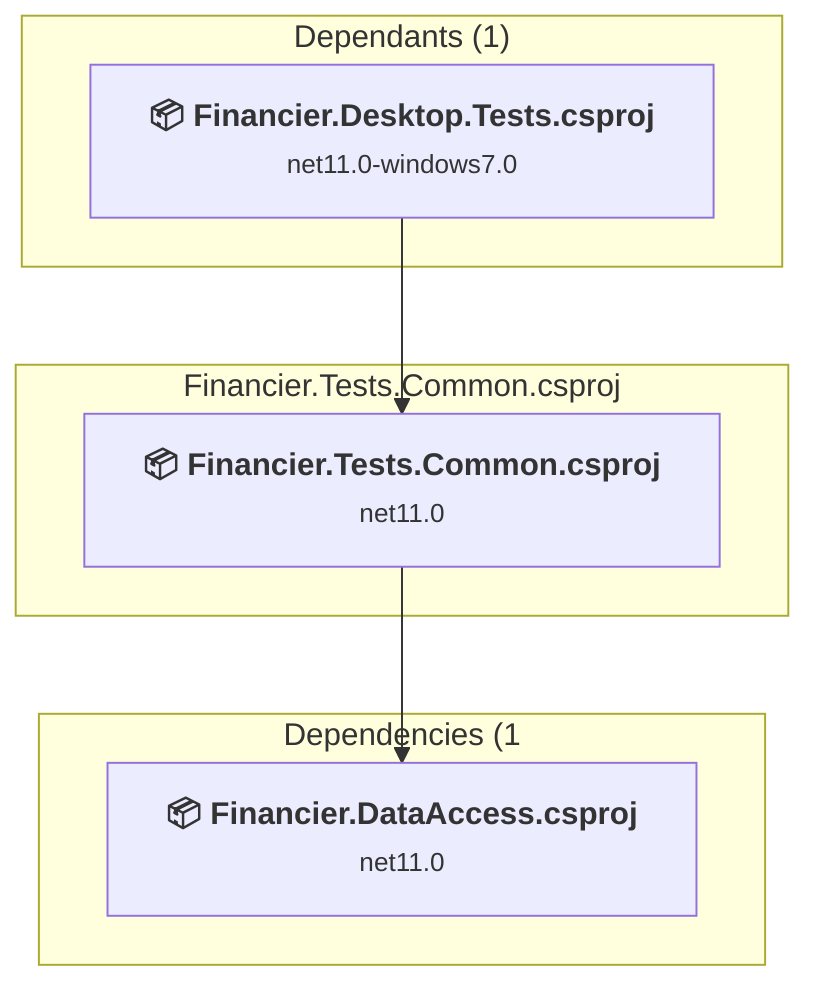

# Projects and dependencies analysis

This document provides a comprehensive overview of the projects and their dependencies in the context of upgrading to .NETCoreApp,Version=v11.0.

## Table of Contents

- [Executive Summary](#executive-Summary)
  - [Highlevel Metrics](#highlevel-metrics)
  - [Projects Compatibility](#projects-compatibility)
  - [Package Compatibility](#package-compatibility)
  - [API Compatibility](#api-compatibility)
  - [Binding Redirect Configuration](#binding-redirect-configuration)
- [Aggregate NuGet packages details](#aggregate-nuget-packages-details)
- [Top API Migration Challenges](#top-api-migration-challenges)
  - [Technologies and Features](#technologies-and-features)
  - [Most Frequent API Issues](#most-frequent-api-issues)
- [Projects Relationship Graph](#projects-relationship-graph)
- [Project Details](#project-details)

  - [src\Financier.Adapter\Financier.Adapter.csproj](#srcfinancieradapterfinancieradaptercsproj)
  - [src\Financier.Common\Financier.Common.csproj](#srcfinanciercommonfinanciercommoncsproj)
  - [src\Financier.DataAccess\Financier.DataAccess.csproj](#srcfinancierdataaccessfinancierdataaccesscsproj)
  - [src\Financier.Desktop\Financier.Desktop.csproj](#srcfinancierdesktopfinancierdesktopcsproj)
  - [src\Financier.MAUI\Financier.MAUI.csproj](#srcfinanciermauifinanciermauicsproj)
  - [src\Financier.Reports\Financier.Reports.csproj](#srcfinancierreportsfinancierreportscsproj)
  - [src\Tests\Financier.Desktop.Tests\Financier.Desktop.Tests.csproj](#srctestsfinancierdesktoptestsfinancierdesktoptestscsproj)
  - [src\Tests\Financier.Tests.Common\Financier.Tests.Common.csproj](#srctestsfinanciertestscommonfinanciertestscommoncsproj)

## Executive Summary

### Highlevel Metrics

| Metric | Count | Status |
| :--- | :---: | :--- |
| Total Projects | 8 | 1 require upgrade |
| Total NuGet Packages | 28 | 2 need upgrade |
| Total Code Files | 229 |  |
| Total Code Files with Incidents | 1 |  |
| Total Lines of Code | 14261 |  |
| Total Number of Issues | 3 |  |
| Estimated LOC to modify | 0+ | at least 0.0% of codebase |

### Projects Compatibility

| Project | Target Framework | Difficulty | Package Issues | API Issues | Binding Issues | Est. LOC Impact | Description |
| :--- | :---: | :---: | :---: | :---: | :---: | :---: | :--- |
| [src\Financier.Adapter\Financier.Adapter.csproj](#srcfinancieradapterfinancieradaptercsproj) | net11.0 | ✅ None | 0 | 0 | 0 |  | ClassLibrary, Sdk Style = True |
| [src\Financier.Common\Financier.Common.csproj](#srcfinanciercommonfinanciercommoncsproj) | net11.0-windows | ✅ None | 0 | 0 | 0 |  | Wpf, Sdk Style = True |
| [src\Financier.DataAccess\Financier.DataAccess.csproj](#srcfinancierdataaccessfinancierdataaccesscsproj) | net11.0 | ✅ None | 0 | 0 | 0 |  | ClassLibrary, Sdk Style = True |
| [src\Financier.Desktop\Financier.Desktop.csproj](#srcfinancierdesktopfinancierdesktopcsproj) | net11.0-windows | ✅ None | 0 | 0 | 0 |  | Wpf, Sdk Style = True |
| [src\Financier.MAUI\Financier.MAUI.csproj](#srcfinanciermauifinanciermauicsproj) | net10.0-android;net10.0-ios;net10.0-maccatalyst;net10.0-windows10.0.19041.0 | 🟢 Low | 2 | 0 | 0 |  | DotNetCoreApp, Sdk Style = True |
| [src\Financier.Reports\Financier.Reports.csproj](#srcfinancierreportsfinancierreportscsproj) | net11.0-windows | ✅ None | 0 | 0 | 0 |  | Wpf, Sdk Style = True |
| [src\Tests\Financier.Desktop.Tests\Financier.Desktop.Tests.csproj](#srctestsfinancierdesktoptestsfinancierdesktoptestscsproj) | net11.0-windows7.0 | ✅ None | 0 | 0 | 0 |  | DotNetCoreApp, Sdk Style = True |
| [src\Tests\Financier.Tests.Common\Financier.Tests.Common.csproj](#srctestsfinanciertestscommonfinanciertestscommoncsproj) | net11.0 | ✅ None | 0 | 0 | 0 |  | ClassLibrary, Sdk Style = True |

### Package Compatibility

| Status | Count | Percentage |
| :--- | :---: | :---: |
| ✅ Compatible | 26 | 92.9% |
| ⚠️ Incompatible | 0 | 0.0% |
| 🔄 Upgrade Recommended | 2 | 7.1% |
| ***Total NuGet Packages*** | ***28*** | ***100%*** |

### API Compatibility

| Category | Count | Impact |
| :--- | :---: | :--- |
| 🔴 Binary Incompatible | 0 | High - Require code changes |
| 🟡 Source Incompatible | 0 | Medium - Needs re-compilation and potential conflicting API error fixing |
| 🔵 Behavioral change | 0 | Low - Behavioral changes that may require testing at runtime |
| ✅ Compatible | 0 |  |
| ***Total APIs Analyzed*** | ***0*** |  |

## Aggregate NuGet packages details

| Package | Current Version | Suggested Version | Projects | Description |
| :--- | :---: | :---: | :--- | :--- |
| AutoFixture | 4.17.0 |  | [Financier.Desktop.Tests.csproj](#srctestsfinancierdesktoptestsfinancierdesktoptestscsproj) [Financier.Tests.Common.csproj](#srctestsfinanciertestscommonfinanciertestscommoncsproj) | ✅Compatible |
| AutoFixture.AutoMoq | 4.17.0 |  | [Financier.Desktop.Tests.csproj](#srctestsfinancierdesktoptestsfinancierdesktoptestscsproj) [Financier.Tests.Common.csproj](#srctestsfinanciertestscommonfinanciertestscommoncsproj) | ✅Compatible |
| AutoFixture.Xunit2 | 4.17.0 |  | [Financier.Desktop.Tests.csproj](#srctestsfinancierdesktoptestsfinancierdesktoptestscsproj) [Financier.Tests.Common.csproj](#srctestsfinanciertestscommonfinanciertestscommoncsproj) | ✅Compatible |
| CommunityToolkit.Maui | 11.2.0 |  | [Financier.MAUI.csproj](#srcfinanciermauifinanciermauicsproj) | ✅Compatible |
| CommunityToolkit.MVVM | 8.4.0 |  | [Financier.MAUI.csproj](#srcfinanciermauifinanciermauicsproj) | ✅Compatible |
| CsvHelper | 33.1.0 |  | [Financier.Desktop.csproj](#srcfinancierdesktopfinancierdesktopcsproj) | ✅Compatible |
| DataGridExtensions | 2.5.15 |  | [Financier.Desktop.csproj](#srcfinancierdesktopfinancierdesktopcsproj) | ✅Compatible |
| Docnet.Core | 2.7.0-alpha.1 |  | [Financier.Desktop.csproj](#srcfinancierdesktopfinancierdesktopcsproj) | ✅Compatible |
| DotNetProjects.Extended.Wpf.Toolkit | 5.0.124 |  | [Financier.Common.csproj](#srcfinanciercommonfinanciercommoncsproj) [Financier.Desktop.csproj](#srcfinancierdesktopfinancierdesktopcsproj) [Financier.Reports.csproj](#srcfinancierreportsfinancierreportscsproj) | ✅Compatible |
| Emoji.Wpf | 0.3.4 |  | [Financier.Common.csproj](#srcfinanciercommonfinanciercommoncsproj) [Financier.Desktop.csproj](#srcfinancierdesktopfinancierdesktopcsproj) [Financier.Reports.csproj](#srcfinancierreportsfinancierreportscsproj) | ✅Compatible |
| Microsoft.EntityFrameworkCore.Sqlite | 10.0.3 | 10.0.9 | [Financier.DataAccess.csproj](#srcfinancierdataaccessfinancierdataaccesscsproj) [Financier.MAUI.csproj](#srcfinanciermauifinanciermauicsproj) | NuGet package upgrade is recommended |
| Microsoft.Extensions.Logging.Debug | 10.0.3 | 10.0.9 | [Financier.MAUI.csproj](#srcfinanciermauifinanciermauicsproj) | NuGet package upgrade is recommended |
| Microsoft.Maui.Controls | 9.0.50 |  | [Financier.MAUI.csproj](#srcfinanciermauifinanciermauicsproj) | ✅Compatible |
| Microsoft.Maui.Controls.Compatibility | 9.0.50 |  | [Financier.MAUI.csproj](#srcfinanciermauifinanciermauicsproj) | ✅Compatible |
| Microsoft.Maui.Essentials | 9.0.50 |  | [Financier.MAUI.csproj](#srcfinanciermauifinanciermauicsproj) | ✅Compatible |
| Microsoft.NET.Test.Sdk | 17.12.0 |  | [Financier.Desktop.Tests.csproj](#srctestsfinancierdesktoptestsfinancierdesktoptestscsproj) | ✅Compatible |
| Microsoft.Xaml.Behaviors.Wpf | 1.1.135 |  | [Financier.Desktop.csproj](#srcfinancierdesktopfinancierdesktopcsproj) | ✅Compatible |
| Moq | 4.18.2 |  | [Financier.Desktop.Tests.csproj](#srctestsfinancierdesktoptestsfinancierdesktoptestscsproj) | ✅Compatible |
| Newtonsoft.Json | 13.0.4 |  | [Financier.DataAccess.csproj](#srcfinancierdataaccessfinancierdataaccesscsproj) [Financier.Desktop.csproj](#srcfinancierdesktopfinancierdesktopcsproj) | ✅Compatible |
| NLog | 6.0.2 |  | [Financier.DataAccess.csproj](#srcfinancierdataaccessfinancierdataaccesscsproj) [Financier.Desktop.csproj](#srcfinancierdesktopfinancierdesktopcsproj) | ✅Compatible |
| OxyPlot.Wpf | 2.1.0 |  | [Financier.Reports.csproj](#srcfinancierreportsfinancierreportscsproj) | ✅Compatible |
| Prism.Core | 9.0.537 |  | [Financier.Common.csproj](#srcfinanciercommonfinanciercommoncsproj) [Financier.Desktop.csproj](#srcfinancierdesktopfinancierdesktopcsproj) [Financier.Reports.csproj](#srcfinancierreportsfinancierreportscsproj) | ✅Compatible |
| SonarAnalyzer.CSharp | 10.15.0.120848 |  | [Financier.Desktop.csproj](#srcfinancierdesktopfinancierdesktopcsproj) [Financier.Reports.csproj](#srcfinancierreportsfinancierreportscsproj) | ✅Compatible |
| sqlite-net-pcl | 1.9.172 |  | [Financier.MAUI.csproj](#srcfinanciermauifinanciermauicsproj) | ✅Compatible |
| StyleCop.Analyzers | 1.1.118 |  | [Financier.Desktop.Tests.csproj](#srctestsfinancierdesktoptestsfinancierdesktoptestscsproj) | ✅Compatible |
| WPFChromeTabsMVVM | 1.4.0 |  | [Financier.Common.csproj](#srcfinanciercommonfinanciercommoncsproj) | ✅Compatible |
| xunit | 2.9.2 |  | [Financier.Desktop.Tests.csproj](#srctestsfinancierdesktoptestsfinancierdesktoptestscsproj) | ✅Compatible |
| xunit.runner.visualstudio | 2.8.2 |  | [Financier.Desktop.Tests.csproj](#srctestsfinancierdesktoptestsfinancierdesktoptestscsproj) | ✅Compatible |

## Top API Migration Challenges

### Technologies and Features

| Technology | Issues | Percentage | Migration Path |
| :--- | :---: | :---: | :--- |

### Most Frequent API Issues

| API | Count | Percentage | Category |
| :--- | :---: | :---: | :--- |

## Projects Relationship Graph

Legend:
📦 SDK-style project
⚙️ Classic project

## Project Details

### src\Financier.Adapter\Financier.Adapter.csproj

#### Project Info

- **Current Target Framework:** net11.0✅
- **SDK-style**: True
- **Project Kind:** ClassLibrary
- **Dependencies**: 1
- **Dependants**: 1
- **Number of Files**: 12
- **Lines of Code**: 532
- **Estimated LOC to modify**: 0+ (at least 0.0% of the project)

#### Dependency Graph

Legend:
📦 SDK-style project
⚙️ Classic project

### API Compatibility

| Category | Count | Impact |
| :--- | :---: | :--- |
| 🔴 Binary Incompatible | 0 | High - Require code changes |
| 🟡 Source Incompatible | 0 | Medium - Needs re-compilation and potential conflicting API error fixing |
| 🔵 Behavioral change | 0 | Low - Behavioral changes that may require testing at runtime |
| ✅ Compatible | 0 |  |
| ***Total APIs Analyzed*** | ***0*** |  |

### src\Financier.Common\Financier.Common.csproj

#### Project Info

- **Current Target Framework:** net11.0-windows✅
- **SDK-style**: True
- **Project Kind:** Wpf
- **Dependencies**: 1
- **Dependants**: 2
- **Number of Files**: 47
- **Lines of Code**: 1673
- **Estimated LOC to modify**: 0+ (at least 0.0% of the project)

#### Dependency Graph

Legend:
📦 SDK-style project
⚙️ Classic project

### API Compatibility

| Category | Count | Impact |
| :--- | :---: | :--- |
| 🔴 Binary Incompatible | 0 | High - Require code changes |
| 🟡 Source Incompatible | 0 | Medium - Needs re-compilation and potential conflicting API error fixing |
| 🔵 Behavioral change | 0 | Low - Behavioral changes that may require testing at runtime |
| ✅ Compatible | 0 |  |
| ***Total APIs Analyzed*** | ***0*** |  |

### src\Financier.DataAccess\Financier.DataAccess.csproj

#### Project Info

- **Current Target Framework:** net11.0✅
- **SDK-style**: True
- **Project Kind:** ClassLibrary
- **Dependencies**: 0
- **Dependants**: 5
- **Number of Files**: 135
- **Lines of Code**: 3127
- **Estimated LOC to modify**: 0+ (at least 0.0% of the project)

#### Dependency Graph

Legend:
📦 SDK-style project
⚙️ Classic project

### API Compatibility

| Category | Count | Impact |
| :--- | :---: | :--- |
| 🔴 Binary Incompatible | 0 | High - Require code changes |
| 🟡 Source Incompatible | 0 | Medium - Needs re-compilation and potential conflicting API error fixing |
| 🔵 Behavioral change | 0 | Low - Behavioral changes that may require testing at runtime |
| ✅ Compatible | 0 |  |
| ***Total APIs Analyzed*** | ***0*** |  |

### src\Financier.Desktop\Financier.Desktop.csproj

#### Project Info

- **Current Target Framework:** net11.0-windows✅
- **SDK-style**: True
- **Project Kind:** Wpf
- **Dependencies**: 3
- **Dependants**: 1
- **Number of Files**: 74
- **Lines of Code**: 4464
- **Estimated LOC to modify**: 0+ (at least 0.0% of the project)

#### Dependency Graph

Legend:
📦 SDK-style project
⚙️ Classic project

### API Compatibility

| Category | Count | Impact |
| :--- | :---: | :--- |
| 🔴 Binary Incompatible | 0 | High - Require code changes |
| 🟡 Source Incompatible | 0 | Medium - Needs re-compilation and potential conflicting API error fixing |
| 🔵 Behavioral change | 0 | Low - Behavioral changes that may require testing at runtime |
| ✅ Compatible | 0 |  |
| ***Total APIs Analyzed*** | ***0*** |  |

### src\Financier.MAUI\Financier.MAUI.csproj

#### Project Info

- **Current Target Framework:** net10.0-android;net10.0-ios;net10.0-maccatalyst;net10.0-windows10.0.19041.0
- **Proposed Target Framework:** net10.0-android;net10.0-ios;net10.0-maccatalyst;net10.0-windows10.0.19041.0;net11.0-windows
- **SDK-style**: True
- **Project Kind:** DotNetCoreApp
- **Dependencies**: 0
- **Dependants**: 0
- **Number of Files**: 20
- **Number of Files with Incidents**: 1
- **Lines of Code**: 318
- **Estimated LOC to modify**: 0+ (at least 0.0% of the project)

#### Dependency Graph

Legend:
📦 SDK-style project
⚙️ Classic project

### API Compatibility

| Category | Count | Impact |
| :--- | :---: | :--- |
| 🔴 Binary Incompatible | 0 | High - Require code changes |
| 🟡 Source Incompatible | 0 | Medium - Needs re-compilation and potential conflicting API error fixing |
| 🔵 Behavioral change | 0 | Low - Behavioral changes that may require testing at runtime |
| ✅ Compatible | 0 |  |
| ***Total APIs Analyzed*** | ***0*** |  |

### src\Financier.Reports\Financier.Reports.csproj

#### Project Info

- **Current Target Framework:** net11.0-windows✅
- **SDK-style**: True
- **Project Kind:** Wpf
- **Dependencies**: 2
- **Dependants**: 1
- **Number of Files**: 23
- **Lines of Code**: 1425
- **Estimated LOC to modify**: 0+ (at least 0.0% of the project)

#### Dependency Graph

Legend:
📦 SDK-style project
⚙️ Classic project

### API Compatibility

| Category | Count | Impact |
| :--- | :---: | :--- |
| 🔴 Binary Incompatible | 0 | High - Require code changes |
| 🟡 Source Incompatible | 0 | Medium - Needs re-compilation and potential conflicting API error fixing |
| 🔵 Behavioral change | 0 | Low - Behavioral changes that may require testing at runtime |
| ✅ Compatible | 0 |  |
| ***Total APIs Analyzed*** | ***0*** |  |

### src\Tests\Financier.Desktop.Tests\Financier.Desktop.Tests.csproj

#### Project Info

- **Current Target Framework:** net11.0-windows7.0✅
- **SDK-style**: True
- **Project Kind:** DotNetCoreApp
- **Dependencies**: 3
- **Dependants**: 0
- **Number of Files**: 19
- **Lines of Code**: 2495
- **Estimated LOC to modify**: 0+ (at least 0.0% of the project)

#### Dependency Graph

Legend:
📦 SDK-style project
⚙️ Classic project

### API Compatibility

| Category | Count | Impact |
| :--- | :---: | :--- |
| 🔴 Binary Incompatible | 0 | High - Require code changes |
| 🟡 Source Incompatible | 0 | Medium - Needs re-compilation and potential conflicting API error fixing |
| 🔵 Behavioral change | 0 | Low - Behavioral changes that may require testing at runtime |
| ✅ Compatible | 0 |  |
| ***Total APIs Analyzed*** | ***0*** |  |

### src\Tests\Financier.Tests.Common\Financier.Tests.Common.csproj

#### Project Info

- **Current Target Framework:** net11.0✅
- **SDK-style**: True
- **Project Kind:** ClassLibrary
- **Dependencies**: 1
- **Dependants**: 1
- **Number of Files**: 6
- **Lines of Code**: 227
- **Estimated LOC to modify**: 0+ (at least 0.0% of the project)

#### Dependency Graph

Legend:
📦 SDK-style project
⚙️ Classic project

### API Compatibility

| Category | Count | Impact |
| :--- | :---: | :--- |
| 🔴 Binary Incompatible | 0 | High - Require code changes |
| 🟡 Source Incompatible | 0 | Medium - Needs re-compilation and potential conflicting API error fixing |
| 🔵 Behavioral change | 0 | Low - Behavioral changes that may require testing at runtime |
| ✅ Compatible | 0 |  |
| ***Total APIs Analyzed*** | ***0*** |  |

