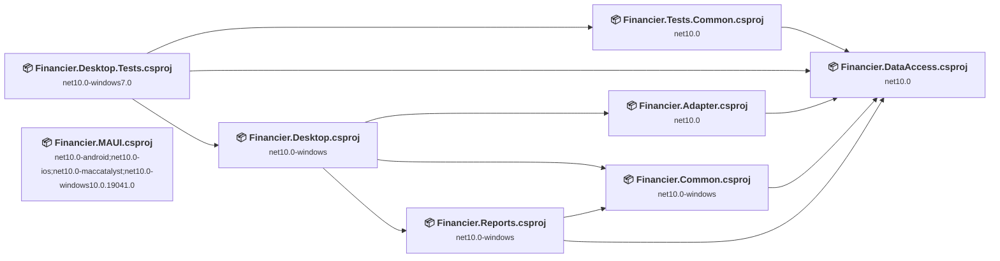
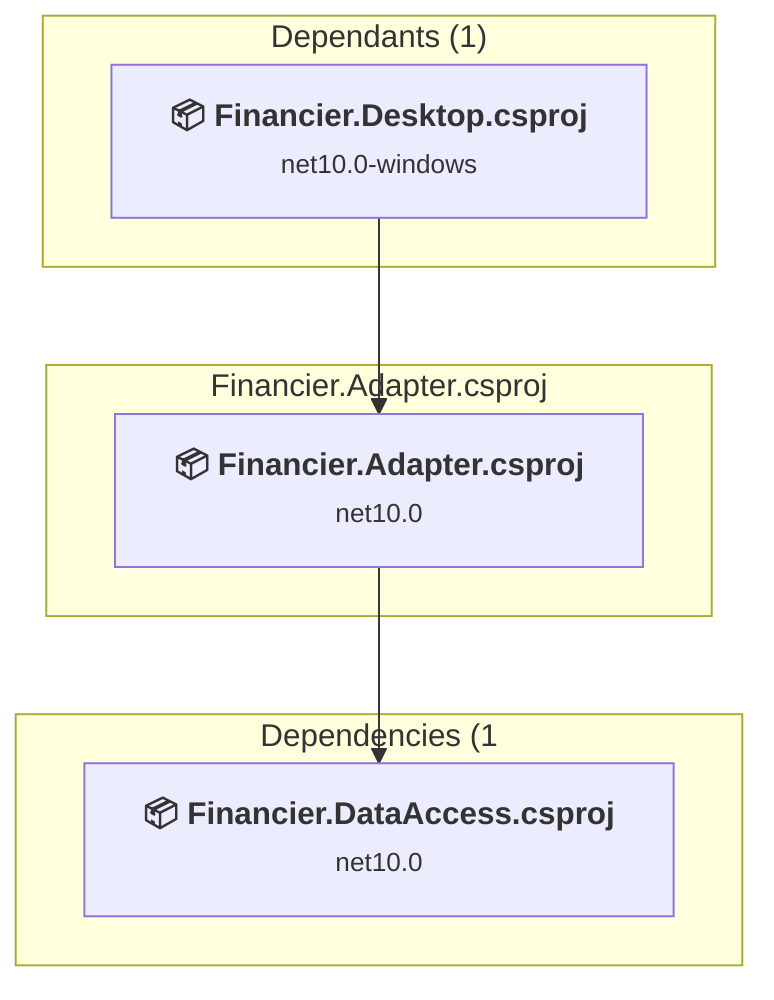
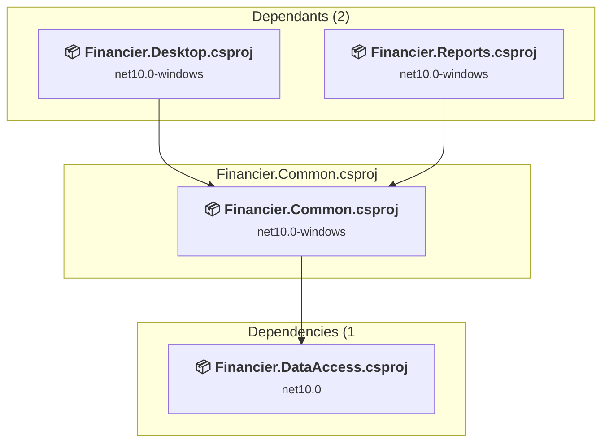
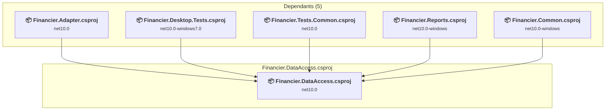
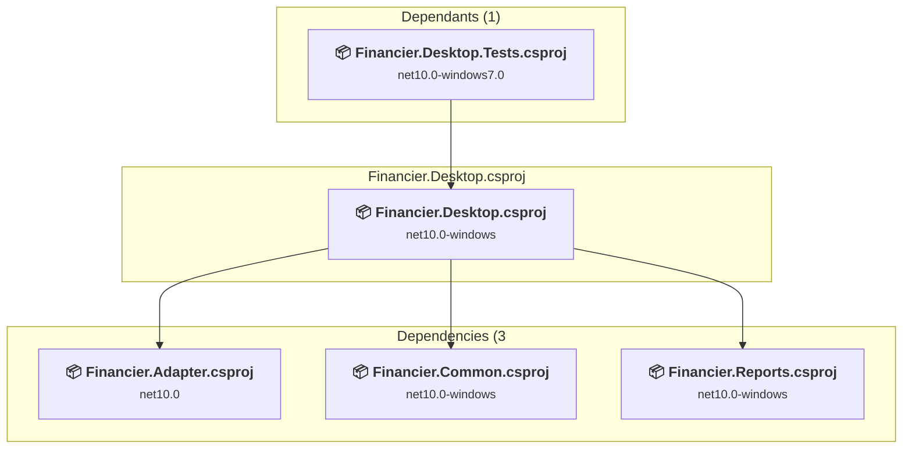
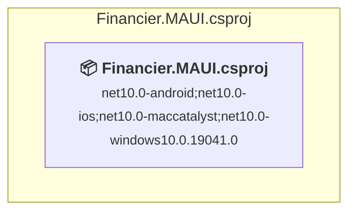
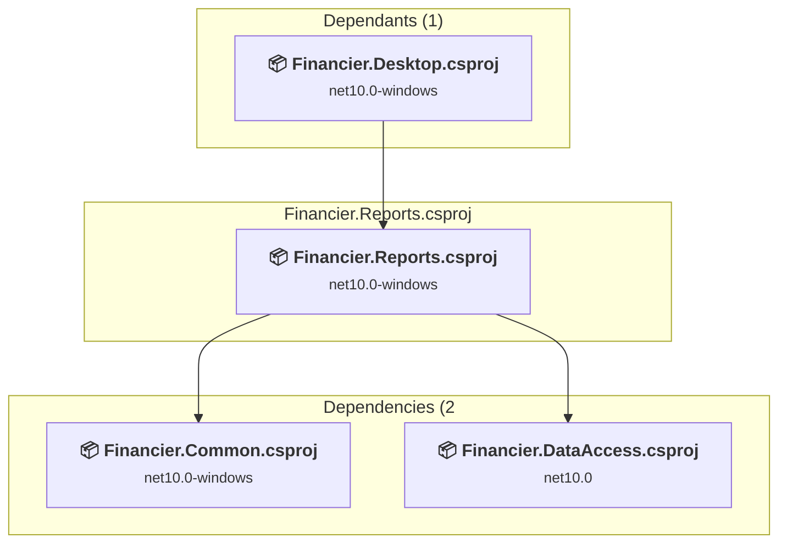
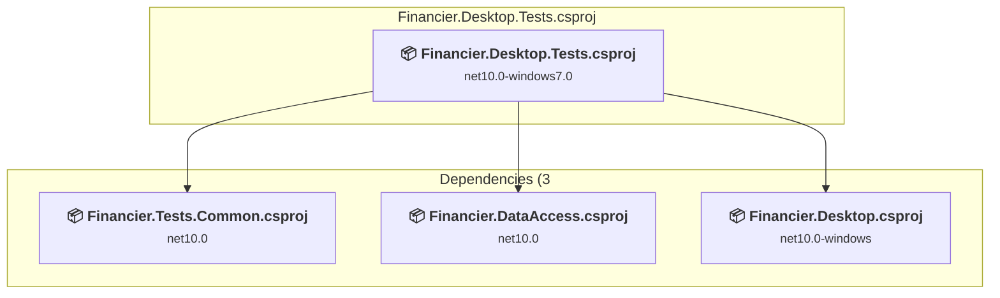
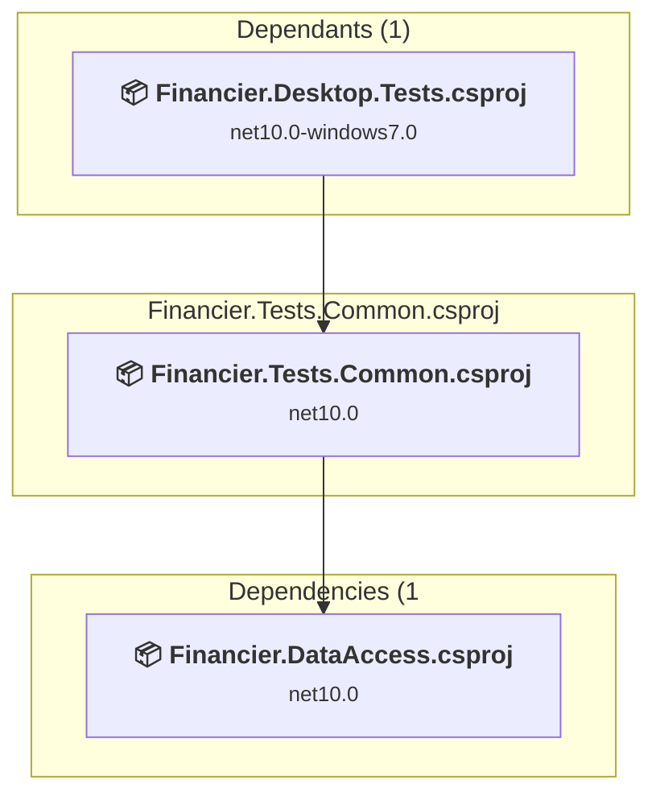

# Projects and dependencies analysis

This document provides a comprehensive overview of the projects and their dependencies in the context of upgrading to .NETCoreApp,Version=v11.0.

## Table of Contents

- [Executive Summary](#executive-Summary)
  - [Highlevel Metrics](#highlevel-metrics)
  - [Projects Compatibility](#projects-compatibility)
  - [Package Compatibility](#package-compatibility)
  - [API Compatibility](#api-compatibility)
- [Aggregate NuGet packages details](#aggregate-nuget-packages-details)
- [Top API Migration Challenges](#top-api-migration-challenges)
  - [Technologies and Features](#technologies-and-features)
  - [Most Frequent API Issues](#most-frequent-api-issues)
- [Projects Relationship Graph](#projects-relationship-graph)
- [Project Details](#project-details)

  - [src\Financier.Adapter\Financier.Adapter.csproj](#srcfinancieradapterfinancieradaptercsproj)
  - [src\Financier.Common\Financier.Common.csproj](#srcfinanciercommonfinanciercommoncsproj)
  - [src\Financier.DataAccess\Financier.DataAccess.csproj](#srcfinancierdataaccessfinancierdataaccesscsproj)
  - [src\Financier.Desktop\Financier.Desktop.csproj](#srcfinancierdesktopfinancierdesktopcsproj)
  - [src\Financier.MAUI\Financier.MAUI.csproj](#srcfinanciermauifinanciermauicsproj)
  - [src\Financier.Reports\Financier.Reports.csproj](#srcfinancierreportsfinancierreportscsproj)
  - [src\Tests\Financier.Desktop.Tests\Financier.Desktop.Tests.csproj](#srctestsfinancierdesktoptestsfinancierdesktoptestscsproj)
  - [src\Tests\Financier.Tests.Common\Financier.Tests.Common.csproj](#srctestsfinanciertestscommonfinanciertestscommoncsproj)

## Executive Summary

### Highlevel Metrics

| Metric | Count | Status |
| :--- | :---: | :--- |
| Total Projects | 8 | All require upgrade |
| Total NuGet Packages | 28 | 5 need upgrade |
| Total Code Files | 229 |  |
| Total Code Files with Incidents | 133 |  |
| Total Lines of Code | 14261 |  |
| Total Number of Issues | 1137 |  |
| Estimated LOC to modify | 1122+ | at least 7.9% of codebase |

### Projects Compatibility

| Project | Target Framework | Difficulty | Package Issues | API Issues | Est. LOC Impact | Description |
| :--- | :---: | :---: | :---: | :---: | :---: | :--- |
| [src\Financier.Adapter\Financier.Adapter.csproj](#srcfinancieradapterfinancieradaptercsproj) | net10.0 | 🟢 Low | 0 | 0 |  | ClassLibrary, Sdk Style = True |
| [src\Financier.Common\Financier.Common.csproj](#srcfinanciercommonfinanciercommoncsproj) | net10.0-windows | 🟡 Medium | 0 | 202 | 202+ | Wpf, Sdk Style = True |
| [src\Financier.DataAccess\Financier.DataAccess.csproj](#srcfinancierdataaccessfinancierdataaccesscsproj) | net10.0 | 🟢 Low | 2 | 0 |  | ClassLibrary, Sdk Style = True |
| [src\Financier.Desktop\Financier.Desktop.csproj](#srcfinancierdesktopfinancierdesktopcsproj) | net10.0-windows | 🟡 Medium | 3 | 376 | 376+ | Wpf, Sdk Style = True |
| [src\Financier.MAUI\Financier.MAUI.csproj](#srcfinanciermauifinanciermauicsproj) | net10.0-android;net10.0-ios;net10.0-maccatalyst;net10.0-windows10.0.19041.0 | 🟢 Low | 2 | 452 | 452+ | ClassLibrary, Sdk Style = True |
| [src\Financier.Reports\Financier.Reports.csproj](#srcfinancierreportsfinancierreportscsproj) | net10.0-windows | 🟡 Medium | 0 | 92 | 92+ | Wpf, Sdk Style = True |
| [src\Tests\Financier.Desktop.Tests\Financier.Desktop.Tests.csproj](#srctestsfinancierdesktoptestsfinancierdesktoptestscsproj) | net10.0-windows7.0 | 🟢 Low | 0 | 0 |  | DotNetCoreApp, Sdk Style = True |
| [src\Tests\Financier.Tests.Common\Financier.Tests.Common.csproj](#srctestsfinanciertestscommonfinanciertestscommoncsproj) | net10.0 | 🟢 Low | 0 | 0 |  | ClassLibrary, Sdk Style = True |

### Package Compatibility

| Status | Count | Percentage |
| :--- | :---: | :---: |
| ✅ Compatible | 23 | 82.1% |
| ⚠️ Incompatible | 2 | 7.1% |
| 🔄 Upgrade Recommended | 3 | 10.7% |
| ***Total NuGet Packages*** | ***28*** | ***100%*** |

### API Compatibility

| Category | Count | Impact |
| :--- | :---: | :--- |
| 🔴 Binary Incompatible | 594 | High - Require code changes |
| 🟡 Source Incompatible | 449 | Medium - Needs re-compilation and potential conflicting API error fixing |
| 🔵 Behavioral change | 79 | Low - Behavioral changes that may require testing at runtime |
| ✅ Compatible | 18075 |  |
| ***Total APIs Analyzed*** | ***19197*** |  |

## Aggregate NuGet packages details

| Package | Current Version | Suggested Version | Projects | Description |
| :--- | :---: | :---: | :--- | :--- |
| AutoFixture | 4.17.0 |  | [Financier.Desktop.Tests.csproj](#srctestsfinancierdesktoptestsfinancierdesktoptestscsproj) [Financier.Tests.Common.csproj](#srctestsfinanciertestscommonfinanciertestscommoncsproj) | ✅Compatible |
| AutoFixture.AutoMoq | 4.17.0 |  | [Financier.Desktop.Tests.csproj](#srctestsfinancierdesktoptestsfinancierdesktoptestscsproj) [Financier.Tests.Common.csproj](#srctestsfinanciertestscommonfinanciertestscommoncsproj) | ✅Compatible |
| AutoFixture.Xunit2 | 4.17.0 |  | [Financier.Desktop.Tests.csproj](#srctestsfinancierdesktoptestsfinancierdesktoptestscsproj) [Financier.Tests.Common.csproj](#srctestsfinanciertestscommonfinanciertestscommoncsproj) | ✅Compatible |
| CommunityToolkit.Maui | 11.2.0 |  | [Financier.MAUI.csproj](#srcfinanciermauifinanciermauicsproj) | ✅Compatible |
| CommunityToolkit.MVVM | 8.4.0 |  | [Financier.MAUI.csproj](#srcfinanciermauifinanciermauicsproj) | ✅Compatible |
| CsvHelper | 33.1.0 |  | [Financier.Desktop.csproj](#srcfinancierdesktopfinancierdesktopcsproj) | ✅Compatible |
| DataGridExtensions | 2.6.0 | 2.5.15 | [Financier.Desktop.csproj](#srcfinancierdesktopfinancierdesktopcsproj) | ⚠️NuGet package is incompatible |
| Docnet.Core | 2.7.0-alpha.1 |  | [Financier.Desktop.csproj](#srcfinancierdesktopfinancierdesktopcsproj) | ✅Compatible |
| DotNetProjects.Extended.Wpf.Toolkit | 5.0.124 |  | [Financier.Common.csproj](#srcfinanciercommonfinanciercommoncsproj) [Financier.Desktop.csproj](#srcfinancierdesktopfinancierdesktopcsproj) [Financier.Reports.csproj](#srcfinancierreportsfinancierreportscsproj) | ✅Compatible |
| Emoji.Wpf | 0.3.4 |  | [Financier.Common.csproj](#srcfinanciercommonfinanciercommoncsproj) [Financier.Desktop.csproj](#srcfinancierdesktopfinancierdesktopcsproj) [Financier.Reports.csproj](#srcfinancierreportsfinancierreportscsproj) | ✅Compatible |
| Microsoft.EntityFrameworkCore.Sqlite | 9.0.4 | 10.0.3 | [Financier.DataAccess.csproj](#srcfinancierdataaccessfinancierdataaccesscsproj) [Financier.MAUI.csproj](#srcfinanciermauifinanciermauicsproj) | NuGet package upgrade is recommended |
| Microsoft.Extensions.Logging.Debug | 9.0.1 | 10.0.3 | [Financier.MAUI.csproj](#srcfinanciermauifinanciermauicsproj) | NuGet package upgrade is recommended |
| Microsoft.Maui.Controls | 9.0.50 |  | [Financier.MAUI.csproj](#srcfinanciermauifinanciermauicsproj) | ✅Compatible |
| Microsoft.Maui.Controls.Compatibility | 9.0.50 |  | [Financier.MAUI.csproj](#srcfinanciermauifinanciermauicsproj) | ✅Compatible |
| Microsoft.Maui.Essentials | 9.0.50 |  | [Financier.MAUI.csproj](#srcfinanciermauifinanciermauicsproj) | ✅Compatible |
| Microsoft.NET.Test.Sdk | 17.12.0 |  | [Financier.Desktop.Tests.csproj](#srctestsfinancierdesktoptestsfinancierdesktoptestscsproj) | ✅Compatible |
| Microsoft.Xaml.Behaviors.Wpf | 1.1.135 | 1.1.39 | [Financier.Desktop.csproj](#srcfinancierdesktopfinancierdesktopcsproj) | ⚠️NuGet package is incompatible |
| Moq | 4.18.2 |  | [Financier.Desktop.Tests.csproj](#srctestsfinancierdesktoptestsfinancierdesktoptestscsproj) | ✅Compatible |
| Newtonsoft.Json | 13.0.4-beta1 | 13.0.4 | [Financier.DataAccess.csproj](#srcfinancierdataaccessfinancierdataaccesscsproj) [Financier.Desktop.csproj](#srcfinancierdesktopfinancierdesktopcsproj) | NuGet package upgrade is recommended |
| NLog | 6.0.2 |  | [Financier.DataAccess.csproj](#srcfinancierdataaccessfinancierdataaccesscsproj) [Financier.Desktop.csproj](#srcfinancierdesktopfinancierdesktopcsproj) | ✅Compatible |
| OxyPlot.Wpf | 2.1.0 |  | [Financier.Reports.csproj](#srcfinancierreportsfinancierreportscsproj) | ✅Compatible |
| Prism.Core | 9.0.537 |  | [Financier.Common.csproj](#srcfinanciercommonfinanciercommoncsproj) [Financier.Desktop.csproj](#srcfinancierdesktopfinancierdesktopcsproj) [Financier.Reports.csproj](#srcfinancierreportsfinancierreportscsproj) | ✅Compatible |
| SonarAnalyzer.CSharp | 10.15.0.120848 |  | [Financier.Desktop.csproj](#srcfinancierdesktopfinancierdesktopcsproj) [Financier.Reports.csproj](#srcfinancierreportsfinancierreportscsproj) | ✅Compatible |
| sqlite-net-pcl | 1.9.172 |  | [Financier.MAUI.csproj](#srcfinanciermauifinanciermauicsproj) | ✅Compatible |
| StyleCop.Analyzers | 1.1.118 |  | [Financier.Desktop.Tests.csproj](#srctestsfinancierdesktoptestsfinancierdesktoptestscsproj) | ✅Compatible |
| WPFChromeTabsMVVM | 1.4.0 |  | [Financier.Common.csproj](#srcfinanciercommonfinanciercommoncsproj) | ✅Compatible |
| xunit | 2.9.2 |  | [Financier.Desktop.Tests.csproj](#srctestsfinancierdesktoptestsfinancierdesktoptestscsproj) | ✅Compatible |
| xunit.runner.visualstudio | 2.8.2 |  | [Financier.Desktop.Tests.csproj](#srctestsfinancierdesktoptestsfinancierdesktoptestscsproj) | ✅Compatible |

## Top API Migration Challenges

### Technologies and Features

| Technology | Issues | Percentage | Migration Path |
| :--- | :---: | :---: | :--- |
| WPF (Windows Presentation Foundation) | 346 | 30.8% | WPF APIs for building Windows desktop applications with XAML-based UI that are available in .NET on Windows. WPF provides rich desktop UI capabilities with data binding and styling. Enable Windows Desktop support: Option 1 (Recommended): Target net9.0-windows; Option 2: Add <UseWindowsDesktop>true</UseWindowsDesktop>. |
| Windows Forms | 32 | 2.9% | Windows Forms APIs for building Windows desktop applications with traditional Forms-based UI that are available in .NET on Windows. Enable Windows Desktop support: Option 1 (Recommended): Target net9.0-windows; Option 2: Add <UseWindowsDesktop>true</UseWindowsDesktop>; Option 3 (Legacy): Use Microsoft.NET.Sdk.WindowsDesktop SDK. |
| Legacy Configuration System | 2 | 0.2% | Legacy XML-based configuration system (app.config/web.config) that has been replaced by a more flexible configuration model in .NET Core. The old system was rigid and XML-based. Migrate to Microsoft.Extensions.Configuration with JSON/environment variables; use System.Configuration.ConfigurationManager NuGet package as interim bridge if needed. |

### Most Frequent API Issues

| API | Count | Percentage | Category |
| :--- | :---: | :---: | :--- |
| T:Microsoft.Maui.Controls.Animation | 90 | 8.0% | Source Incompatible |
| M:System.Windows.Controls.UserControl.#ctor | 72 | 6.4% | Binary Incompatible |
| P:Microsoft.Maui.Controls.InputView.TextColor | 52 | 4.6% | Source Incompatible |
| T:System.Windows.Application | 43 | 3.8% | Binary Incompatible |
| T:System.Uri | 40 | 3.6% | Behavioral Change |
| M:Microsoft.Maui.Controls.Animation.#ctor(System.Action{System.Double},System.Double,System.Double,Microsoft.Maui.Easing,System.Action) | 40 | 3.6% | Source Incompatible |
| M:Microsoft.Maui.Controls.Animation.Add(System.Double,System.Double,Microsoft.Maui.Controls.Animation) | 40 | 3.6% | Source Incompatible |
| M:System.Uri.#ctor(System.String,System.UriKind) | 39 | 3.5% | Behavioral Change |
| M:System.Windows.Application.LoadComponent(System.Object,System.Uri) | 38 | 3.4% | Binary Incompatible |
| T:System.Windows.Markup.IComponentConnector | 38 | 3.4% | Binary Incompatible |
| T:System.Windows.Controls.UserControl | 36 | 3.2% | Binary Incompatible |
| T:System.Windows.Controls.RadioButton | 28 | 2.5% | Binary Incompatible |
| T:Microsoft.Maui.Controls.BindingMode | 20 | 1.8% | Source Incompatible |
| T:System.Windows.Visibility | 18 | 1.6% | Binary Incompatible |
| P:Microsoft.Maui.Controls.DatePicker.TextColor | 13 | 1.2% | Source Incompatible |
| P:Microsoft.Maui.Controls.TimePicker.TextColor | 13 | 1.2% | Source Incompatible |
| P:Microsoft.Maui.Controls.Picker.TextColor | 13 | 1.2% | Source Incompatible |
| P:Microsoft.Maui.Controls.Button.TextColor | 13 | 1.2% | Source Incompatible |
| P:Microsoft.Maui.Controls.Label.TextColor | 13 | 1.2% | Source Incompatible |
| P:Microsoft.Maui.Controls.RadioButton.TextColor | 13 | 1.2% | Source Incompatible |
| T:System.Windows.Documents.Run | 12 | 1.1% | Binary Incompatible |
| T:System.Windows.Forms.DialogResult | 10 | 0.9% | Binary Incompatible |
| T:Microsoft.Maui.Easing | 10 | 0.9% | Source Incompatible |
| M:Microsoft.Maui.Controls.Animation.#ctor | 10 | 0.9% | Source Incompatible |
| M:Microsoft.Maui.Controls.Animation.Commit(Microsoft.Maui.Controls.IAnimatable,System.String,System.UInt32,System.UInt32,Microsoft.Maui.Easing,System.Action{System.Double,System.Boolean},System.Func{System.Boolean}) | 10 | 0.9% | Source Incompatible |
| T:System.Windows.Controls.DatePicker | 8 | 0.7% | Binary Incompatible |
| T:System.Windows.Controls.TextBlock | 8 | 0.7% | Binary Incompatible |
| T:System.Windows.Media.Brushes | 8 | 0.7% | Binary Incompatible |
| T:System.Windows.Media.SolidColorBrush | 8 | 0.7% | Binary Incompatible |
| T:System.Windows.DependencyProperty | 7 | 0.6% | Binary Incompatible |
| T:Microsoft.Maui.Controls.Xaml.Extensions | 7 | 0.6% | Source Incompatible |
| T:System.Windows.Controls.TextBox | 6 | 0.5% | Binary Incompatible |
| T:System.Windows.Media.Brush | 6 | 0.5% | Binary Incompatible |
| T:System.Windows.Controls.Ribbon.RibbonGroup | 6 | 0.5% | Binary Incompatible |
| P:Microsoft.Maui.Controls.BindableObject.BindingContext | 6 | 0.5% | Source Incompatible |
| M:Microsoft.Maui.Controls.ContentPage.#ctor | 6 | 0.5% | Source Incompatible |
| F:System.Windows.Visibility.Collapsed | 5 | 0.4% | Binary Incompatible |
| T:System.Windows.Data.IValueConverter | 5 | 0.4% | Binary Incompatible |
| T:System.Windows.Controls.DataGridColumn | 5 | 0.4% | Binary Incompatible |
| P:System.Windows.Controls.DataGridAutoGeneratingColumnEventArgs.Column | 5 | 0.4% | Binary Incompatible |
| T:System.Windows.Controls.DataGrid | 5 | 0.4% | Binary Incompatible |
| T:System.Windows.Documents.InlineCollection | 5 | 0.4% | Binary Incompatible |
| P:System.Windows.Documents.Paragraph.Inlines | 5 | 0.4% | Binary Incompatible |
| T:Microsoft.Maui.Hosting.MauiApp | 5 | 0.4% | Source Incompatible |
| P:System.Windows.Controls.DatePicker.SelectedDate | 4 | 0.4% | Binary Incompatible |
| P:System.Windows.FrameworkElement.DataContext | 4 | 0.4% | Binary Incompatible |
| T:System.Windows.Window | 4 | 0.4% | Binary Incompatible |
| T:System.Windows.RoutedEventHandler | 4 | 0.4% | Binary Incompatible |
| M:Microsoft.Maui.Controls.ResourceDictionary.#ctor | 4 | 0.4% | Source Incompatible |
| P:Microsoft.Maui.Hosting.MauiAppBuilder.Services | 4 | 0.4% | Source Incompatible |

## Projects Relationship Graph

Legend:
📦 SDK-style project
⚙️ Classic project

## Project Details

### src\Financier.Adapter\Financier.Adapter.csproj

#### Project Info

- **Current Target Framework:** net10.0
- **Proposed Target Framework:** net11.0
- **SDK-style**: True
- **Project Kind:** ClassLibrary
- **Dependencies**: 1
- **Dependants**: 1
- **Number of Files**: 12
- **Number of Files with Incidents**: 1
- **Lines of Code**: 532
- **Estimated LOC to modify**: 0+ (at least 0.0% of the project)

#### Dependency Graph

Legend:
📦 SDK-style project
⚙️ Classic project

### API Compatibility

| Category | Count | Impact |
| :--- | :---: | :--- |
| 🔴 Binary Incompatible | 0 | High - Require code changes |
| 🟡 Source Incompatible | 0 | Medium - Needs re-compilation and potential conflicting API error fixing |
| 🔵 Behavioral change | 0 | Low - Behavioral changes that may require testing at runtime |
| ✅ Compatible | 636 |  |
| ***Total APIs Analyzed*** | ***636*** |  |

### src\Financier.Common\Financier.Common.csproj

#### Project Info

- **Current Target Framework:** net10.0-windows
- **Proposed Target Framework:** net11.0-windows
- **SDK-style**: True
- **Project Kind:** Wpf
- **Dependencies**: 1
- **Dependants**: 2
- **Number of Files**: 47
- **Number of Files with Incidents**: 33
- **Lines of Code**: 1673
- **Estimated LOC to modify**: 202+ (at least 12.1% of the project)

#### Dependency Graph

Legend:
📦 SDK-style project
⚙️ Classic project

### API Compatibility

| Category | Count | Impact |
| :--- | :---: | :--- |
| 🔴 Binary Incompatible | 180 | High - Require code changes |
| 🟡 Source Incompatible | 0 | Medium - Needs re-compilation and potential conflicting API error fixing |
| 🔵 Behavioral change | 22 | Low - Behavioral changes that may require testing at runtime |
| ✅ Compatible | 1873 |  |
| ***Total APIs Analyzed*** | ***2075*** |  |

#### Project Technologies and Features

| Technology | Issues | Percentage | Migration Path |
| :--- | :---: | :---: | :--- |
| WPF (Windows Presentation Foundation) | 103 | 51.0% | WPF APIs for building Windows desktop applications with XAML-based UI that are available in .NET on Windows. WPF provides rich desktop UI capabilities with data binding and styling. Enable Windows Desktop support: Option 1 (Recommended): Target net9.0-windows; Option 2: Add <UseWindowsDesktop>true</UseWindowsDesktop>. |

### src\Financier.DataAccess\Financier.DataAccess.csproj

#### Project Info

- **Current Target Framework:** net10.0
- **Proposed Target Framework:** net11.0
- **SDK-style**: True
- **Project Kind:** ClassLibrary
- **Dependencies**: 0
- **Dependants**: 5
- **Number of Files**: 135
- **Number of Files with Incidents**: 1
- **Lines of Code**: 3127
- **Estimated LOC to modify**: 0+ (at least 0.0% of the project)

#### Dependency Graph

Legend:
📦 SDK-style project
⚙️ Classic project

### API Compatibility

| Category | Count | Impact |
| :--- | :---: | :--- |
| 🔴 Binary Incompatible | 0 | High - Require code changes |
| 🟡 Source Incompatible | 0 | Medium - Needs re-compilation and potential conflicting API error fixing |
| 🔵 Behavioral change | 0 | Low - Behavioral changes that may require testing at runtime |
| ✅ Compatible | 2747 |  |
| ***Total APIs Analyzed*** | ***2747*** |  |

### src\Financier.Desktop\Financier.Desktop.csproj

#### Project Info

- **Current Target Framework:** net10.0-windows
- **Proposed Target Framework:** net11.0-windows
- **SDK-style**: True
- **Project Kind:** Wpf
- **Dependencies**: 3
- **Dependants**: 1
- **Number of Files**: 74
- **Number of Files with Incidents**: 49
- **Lines of Code**: 4464
- **Estimated LOC to modify**: 376+ (at least 8.4% of the project)

#### Dependency Graph

Legend:
📦 SDK-style project
⚙️ Classic project

### API Compatibility

| Category | Count | Impact |
| :--- | :---: | :--- |
| 🔴 Binary Incompatible | 331 | High - Require code changes |
| 🟡 Source Incompatible | 2 | Medium - Needs re-compilation and potential conflicting API error fixing |
| 🔵 Behavioral change | 43 | Low - Behavioral changes that may require testing at runtime |
| ✅ Compatible | 5261 |  |
| ***Total APIs Analyzed*** | ***5637*** |  |

#### Project Technologies and Features

| Technology | Issues | Percentage | Migration Path |
| :--- | :---: | :---: | :--- |
| Legacy Configuration System | 2 | 0.5% | Legacy XML-based configuration system (app.config/web.config) that has been replaced by a more flexible configuration model in .NET Core. The old system was rigid and XML-based. Migrate to Microsoft.Extensions.Configuration with JSON/environment variables; use System.Configuration.ConfigurationManager NuGet package as interim bridge if needed. |
| Windows Forms | 32 | 8.5% | Windows Forms APIs for building Windows desktop applications with traditional Forms-based UI that are available in .NET on Windows. Enable Windows Desktop support: Option 1 (Recommended): Target net9.0-windows; Option 2: Add <UseWindowsDesktop>true</UseWindowsDesktop>; Option 3 (Legacy): Use Microsoft.NET.Sdk.WindowsDesktop SDK. |
| WPF (Windows Presentation Foundation) | 185 | 49.2% | WPF APIs for building Windows desktop applications with XAML-based UI that are available in .NET on Windows. WPF provides rich desktop UI capabilities with data binding and styling. Enable Windows Desktop support: Option 1 (Recommended): Target net9.0-windows; Option 2: Add <UseWindowsDesktop>true</UseWindowsDesktop>. |

### src\Financier.MAUI\Financier.MAUI.csproj

#### Project Info

- **Current Target Framework:** net10.0-android;net10.0-ios;net10.0-maccatalyst;net10.0-windows10.0.19041.0
- **Proposed Target Framework:** net10.0-android;net10.0-ios;net10.0-maccatalyst;net10.0-windows10.0.19041.0;net11.0-windows
- **SDK-style**: True
- **Project Kind:** ClassLibrary
- **Dependencies**: 0
- **Dependants**: 0
- **Number of Files**: 20
- **Number of Files with Incidents**: 29
- **Lines of Code**: 318
- **Estimated LOC to modify**: 452+ (at least 142.1% of the project)

#### Dependency Graph

Legend:
📦 SDK-style project
⚙️ Classic project

### API Compatibility

| Category | Count | Impact |
| :--- | :---: | :--- |
| 🔴 Binary Incompatible | 5 | High - Require code changes |
| 🟡 Source Incompatible | 447 | Medium - Needs re-compilation and potential conflicting API error fixing |
| 🔵 Behavioral change | 0 | Low - Behavioral changes that may require testing at runtime |
| ✅ Compatible | 1112 |  |
| ***Total APIs Analyzed*** | ***1564*** |  |

### src\Financier.Reports\Financier.Reports.csproj

#### Project Info

- **Current Target Framework:** net10.0-windows
- **Proposed Target Framework:** net11.0-windows
- **SDK-style**: True
- **Project Kind:** Wpf
- **Dependencies**: 2
- **Dependants**: 1
- **Number of Files**: 23
- **Number of Files with Incidents**: 18
- **Lines of Code**: 1425
- **Estimated LOC to modify**: 92+ (at least 6.5% of the project)

#### Dependency Graph

Legend:
📦 SDK-style project
⚙️ Classic project

### API Compatibility

| Category | Count | Impact |
| :--- | :---: | :--- |
| 🔴 Binary Incompatible | 78 | High - Require code changes |
| 🟡 Source Incompatible | 0 | Medium - Needs re-compilation and potential conflicting API error fixing |
| 🔵 Behavioral change | 14 | Low - Behavioral changes that may require testing at runtime |
| ✅ Compatible | 1618 |  |
| ***Total APIs Analyzed*** | ***1710*** |  |

#### Project Technologies and Features

| Technology | Issues | Percentage | Migration Path |
| :--- | :---: | :---: | :--- |
| WPF (Windows Presentation Foundation) | 58 | 63.0% | WPF APIs for building Windows desktop applications with XAML-based UI that are available in .NET on Windows. WPF provides rich desktop UI capabilities with data binding and styling. Enable Windows Desktop support: Option 1 (Recommended): Target net9.0-windows; Option 2: Add <UseWindowsDesktop>true</UseWindowsDesktop>. |

### src\Tests\Financier.Desktop.Tests\Financier.Desktop.Tests.csproj

#### Project Info

- **Current Target Framework:** net10.0-windows7.0
- **Proposed Target Framework:** net11.0--windows7.0
- **SDK-style**: True
- **Project Kind:** DotNetCoreApp
- **Dependencies**: 3
- **Dependants**: 0
- **Number of Files**: 19
- **Number of Files with Incidents**: 1
- **Lines of Code**: 2495
- **Estimated LOC to modify**: 0+ (at least 0.0% of the project)

#### Dependency Graph

Legend:
📦 SDK-style project
⚙️ Classic project

### API Compatibility

| Category | Count | Impact |
| :--- | :---: | :--- |
| 🔴 Binary Incompatible | 0 | High - Require code changes |
| 🟡 Source Incompatible | 0 | Medium - Needs re-compilation and potential conflicting API error fixing |
| 🔵 Behavioral change | 0 | Low - Behavioral changes that may require testing at runtime |
| ✅ Compatible | 4636 |  |
| ***Total APIs Analyzed*** | ***4636*** |  |

### src\Tests\Financier.Tests.Common\Financier.Tests.Common.csproj

#### Project Info

- **Current Target Framework:** net10.0
- **Proposed Target Framework:** net11.0
- **SDK-style**: True
- **Project Kind:** ClassLibrary
- **Dependencies**: 1
- **Dependants**: 1
- **Number of Files**: 6
- **Number of Files with Incidents**: 1
- **Lines of Code**: 227
- **Estimated LOC to modify**: 0+ (at least 0.0% of the project)

#### Dependency Graph

Legend:
📦 SDK-style project
⚙️ Classic project

### API Compatibility

| Category | Count | Impact |
| :--- | :---: | :--- |
| 🔴 Binary Incompatible | 0 | High - Require code changes |
| 🟡 Source Incompatible | 0 | Medium - Needs re-compilation and potential conflicting API error fixing |
| 🔵 Behavioral change | 0 | Low - Behavioral changes that may require testing at runtime |
| ✅ Compatible | 192 |  |
| ***Total APIs Analyzed*** | ***192*** |  |

